```mermaid
classDiagram
    %% ===================== BOUNDARY LAYER (React Components) =====================
    class Layout {
        <<Component>>
        +useState: currentPage, sidebarOpen
        +menuItems: MenuItem[]
        +children: ReactNode
    }
    
    class SensorManagement {
        <<Component>>
        +useState: sensors, loading, showForm
        +loadSensors()
        +handleSubmit()
        +handleEdit()
        +handleDelete()
        +handleViewLogs()
    }
    
    class ActuatorManagement {
        <<Component>>
        +useState: actuators, showGrpcModal, grpcLoading
        +loadActuators()
        +handleSubmit()
        +handleEdit()
        +handleDelete()
        +handleGrpcControl()
        +handleOpenGrpcModal()
    }
    
    class SensorData {
        <<Component>>
        +useState: data, loading
        +loadSensorData()
        +displayRealtimeData()
    }
    
    class Logs {
        <<Component>>
        +useState: logs, filter
        +onLog()
        +clearLogs()
    }
    
    class StatusBar {
        <<Component>>
        +serverStatus
        +mqttStatus
        +lastUpdate
    }
    
    class SensorLogs {
        <<Component>>
        +useState: logs, loading
        +loadLogs()
        +displayTable()
    }
    
    class GrpcControlModal {
        <<Component>>
        +actuator: Actuator
        +loading: boolean
        +onControl()
        +onClose()
    }
    
    %% ===================== CONTROLLER LAYER (Express Routes) =====================
    class DeviceController {
        <<Controller>>
        +POST /api/devices/control/:deviceId
        +GET /api/devices
        +GET /api/devices/:deviceId
        +PUT /api/devices/:deviceId
        +DELETE /api/devices/:deviceId
        +POST /api/devices/grpc/control/:deviceId
        +GET /api/devices/grpc/status/:deviceId
    }
    
    class DebugController {
        <<Controller>>
        +GET /api/debug/seed-data
    }
    
    class SensorDataController {
        <<Controller>>
        +GET /api/demo/sensor-data
    }
    
    class ThresholdController {
        <<Controller>>
        +POST /api/thresholds
        +GET /api/thresholds
        +PUT /api/thresholds/:id
        +DELETE /api/thresholds/:id
    }
    
    class AlertController {
        <<Controller>>
        +POST /api/alerts
        +GET /api/alerts
        +GET /api/alerts/:id
    }
    
    class UserController {
        <<Controller>>
        +POST /api/users
        +GET /api/users
        +PUT /api/users/:id
        +DELETE /api/users/:id
    }
    
    %% ===================== APPLICATION LAYER (Business Logic) =====================
    class ActuatorService {
        <<Service>>
        -ActuatorRepository
        +controlDevice(target, command, controlledBy)
        +getDeviceStatus(deviceId)
        +getAllDevices(filters)
        +getDeviceById(deviceId)
        +registerDevice(deviceData)
        +updateDevice(deviceId, updateData)
        +deleteDevice(deviceId)
        +updateActuatorStatus(deviceId, statusData)
        +toggleAutomaticMode(deviceId, isAutomatic)
    }
    
    class AutomationService {
        <<Service>>
        -ThresholdRepository
        -ActuatorRepository
        -EventBus
        +EvaluateThreshold(sensorData, threshold)
        +TriggerActuator(deviceId, action)
        +HandleThresholdExceeded(event)
    }
    
    class ThresholdService {
        <<Service>>
        -ThresholdRepository
        +GetActiveThresholds(sensorType, zone)
        +CreateThreshold(data)
        +UpdateThreshold(id, data)
        +DeleteThreshold(id)
    }
    
    class NotificationService {
        <<Service>>
        -AlertRepository
        +CreateAlert(alertData)
        +SendNotification(recipients[], channels[], message)
        +SendEmail(recipient, subject, body)
        +SendSMS(phone, message)
    }
    
    class DataCollectorService {
        <<Service>>
        -SensorDataRepository
        -SensorRepository
        -MqttHandler
        +ProcessSensorData(data)
        +ValidateSensorPayload(data)
        +PersistSensorData(data)
        +EmitSensorDataEvent(data)
    }
    
    class UserService {
        <<Service>>
        -UserRepository
        +CreateUser(userData)
        +UpdateUser(userId, data)
        +DeleteUser(userId)
        +GetAllUsers()
        +HashPassword(password)
        +AssignRoles(userId, roles)
    }
    
    class RoleService {
        <<Service>>
        -RoleRepository
        +CreateRole(roleData)
        +UpdateRole(roleId, data)
        +DeleteRole(roleId)
    }
    
    class DefaultDataSeeder {
        <<Utility>>
        -SensorType, Sensor, ActuatorType
        -Farm, Zone, Actuator
        -User, Role
        +Seed()
        +EnsureSensorTypes()
        +EnsureActuatorTypes()
        +EnsureFarms()
        +EnsureZones()
        +EnsureSensors()
        +EnsureActuators()
        +EnsureAdminUser()
    }
    
    %% ===================== INFRASTRUCTURE LAYER =====================
    class ActuatorRepository {
        <<Repository>>
        -mongodb
        +FindAll() Actuator[]
        +FindById(deviceId) Actuator
        +FindByZone(zoneId) Actuator[]
        +Create(data) Actuator
        +Update(deviceId, data) Actuator
        +Delete(deviceId)
        +UpdateStatus(deviceId, status)
    }
    
    class SensorRepository {
        <<Repository>>
        -mongodb
        +FindAll() Sensor[]
        +FindById(sensorId) Sensor
        +FindByZone(zoneId) Sensor[]
        +Create(data) Sensor
        +Update(id, data) Sensor
        +Delete(id)
    }
    
    class SensorDataRepository {
        <<Repository>>
        -mongodb
        +FindAll(filters) SensorData[]
        +FindBySensorId(sensorId, from, to) SensorData[]
        +Create(data) SensorData
        +FindRecent(limit) SensorData[]
    }
    
    class ThresholdRepository {
        <<Repository>>
        -mongodb
        +FindAll() Threshold[]
        +FindById(id) Threshold
        +FindActiveBySensorType(sensorType, zone)
        +Create(data) Threshold
        +Update(id, data) Threshold
        +Delete(id)
    }
    
    class AlertRepository {
        <<Repository>>
        -mongodb
        +FindAll() Alert[]
        +FindById(id) Alert
        +FindByZone(zone) Alert[]
        +Create(data) Alert
        +Update(id, data) Alert
    }
    
    class UserRepository {
        <<Repository>>
        -mongodb
        +FindAll() User[]
        +FindById(id) User
        +FindByUsername(username) User
        +Create(data) User
        +Update(id, data) User
        +Delete(id)
    }
    
    class RoleRepository {
        <<Repository>>
        -mongodb
        +FindAll() Role[]
        +FindById(id) Role
        +Create(data) Role
        +InitializeDefaultRoles()
    }
    
    class MqttHandler {
        <<External>>
        -mqtt.Client
        +Connect()
        +Disconnect()
        +Subscribe(topics[])
        +Publish(topic, payload)
        +OnMessage(callback)
    }
    
    class GrpcClient {
        <<External>>
        -grpc.Client
        -proto
        +Initialize()
        +GetClient(address)
        +ControlActuator(deviceId, action, address)
        +GetActuatorStatus(deviceId, address)
        +CloseAll()
    }
    
    class WebSocketGateway {
        <<Gateway>>
        -io.Server
        +Broadcast(room, event, data)
        +Subscribe(client, room)
    }
    
    class Logger {
        <<Utility>>
        -winston
        +Info(message)
        +Error(message)
        +Warn(message)
    }
    
    class ResponseHandler {
        <<Utility>>
        +success(res, data, message)
        +created(res, data, message)
        +badRequest(res, message, errors)
        +notFound(res, message)
        +serverError(res, message)
    }
    
    %% ===================== DOMAIN LAYER (Entities/Schemas) =====================
    class Sensor {
        <<Entity>>
        +_id: ObjectId
        +sensorId: String
        +name: String
        +sensorType: ObjectId[SensorType]
        +farmId: ObjectId[Farm]
        +zoneId: ObjectId[Zone]
        +status: String
        +isActive: Boolean
        +createdAt: Date
        +updatedAt: Date
    }
    
    class SensorType {
        <<Entity>>
        +_id: ObjectId
        +name: String
        +displayName: String
        +unit: String
        +description: String
        +minValue: Number
        +maxValue: Number
        +isActive: Boolean
    }
    
    class SensorData {
        <<Entity>>
        +_id: ObjectId
        +sensorId: ObjectId[Sensor]
        +sensorType: String
        +value: Number
        +timestamp: Date
        +quality: String
        +createdAt: Date
    }
    
    class Actuator {
        <<Entity>>
        +_id: ObjectId
        +deviceId: String
        +name: String
        +actuatorType: ObjectId[ActuatorType]
        +farmId: ObjectId[Farm]
        +zoneId: ObjectId[Zone]
        +address: String
        +status: String
        +mode: String
        +lastCommand: Object
        +createdAt: Date
        +updatedAt: Date
    }
    
    class ActuatorType {
        <<Entity>>
        +_id: ObjectId
        +name: String
        +displayName: String
        +capabilities: String[]
        +description: String
        +isActive: Boolean
    }
    
    class Farm {
        <<Entity>>
        +_id: ObjectId
        +farmId: String
        +name: String
        +description: String
        +location: Object
        +area: Number
        +owner: ObjectId[User]
        +isActive: Boolean
        +createdAt: Date
    }
    
    class Zone {
        <<Entity>>
        +_id: ObjectId
        +zoneId: String
        +name: String
        +description: String
        +farmId: ObjectId[Farm]
        +location: Object
        +cropType: String
        +createdAt: Date
    }
    
    class Threshold {
        <<Entity>>
        +_id: ObjectId
        +name: String
        +sensorType: ObjectId[SensorType]
        +minValue: Number
        +maxValue: Number
        +action: Object
        +farmId: ObjectId[Farm]
        +zoneId: ObjectId[Zone]
        +isActive: Boolean
        +createdAt: Date
    }
    
    class Alert {
        <<Entity>>
        +_id: ObjectId
        +type: String
        +severity: String
        +message: String
        +thresholdId: ObjectId[Threshold]
        +deviceId: ObjectId[Actuator]
        +farmId: ObjectId[Farm]
        +zoneId: ObjectId[Zone]
        +status: String
        +notifications: Object[]
        +createdAt: Date
    }
    
    class User {
        <<Entity>>
        +_id: ObjectId
        +username: String
        +email: String
        +password: String
        +role: ObjectId[Role][]
        +isActive: Boolean
        +createdAt: Date
        +updatedAt: Date
    }
    
    class Role {
        <<Entity>>
        +_id: ObjectId
        +name: String
        +permissions: String[]
        +description: String
        +isActive: Boolean
        +createdAt: Date
    }
    
    %% ===================== EVENT BUS =====================
    class EventBus {
        <<Mediator>>
        -eventEmitter
        +Publish(eventName, payload)
        +Subscribe(eventName, callback)
        +Unsubscribe(eventName, callback)
    }
    
    %% ===================== RELATIONSHIPS =====================
    %% Components -> Controllers
    ActuatorManagement --> DeviceController
    SensorManagement --> SensorDataController
    Layout --> DeviceController
    
    %% Controllers -> Services
    DeviceController --> ActuatorService
    DeviceController --> GrpcClient
    SensorDataController --> DataCollectorService
    ThresholdController --> ThresholdService
    AlertController --> NotificationService
    UserController --> UserService
    DebugController --> DefaultDataSeeder
    
    %% Services -> Repositories
    ActuatorService --> ActuatorRepository
    AutomationService --> ThresholdRepository
    AutomationService --> ActuatorRepository
    ThresholdService --> ThresholdRepository
    NotificationService --> AlertRepository
    UserService --> UserRepository
    RoleService --> RoleRepository
    DataCollectorService --> SensorDataRepository
    DataCollectorService --> SensorRepository
    
    %% Services -> Infrastructure
    ActuatorService --> MqttHandler
    ActuatorService --> GrpcClient
    DataCollectorService --> MqttHandler
    NotificationService --> MqttHandler
    
    %% Services -> Event Bus
    ActuatorService --> EventBus
    AutomationService --> EventBus
    ThresholdService --> EventBus
    NotificationService --> EventBus
    DataCollectorService --> EventBus
    UserService --> EventBus
    WebSocketGateway --> EventBus
    
    %% Repositories -> Entities
    ActuatorRepository --> Actuator
    ActuatorRepository --> ActuatorType
    SensorRepository --> Sensor
    SensorRepository --> SensorType
    SensorDataRepository --> SensorData
    ThresholdRepository --> Threshold
    AlertRepository --> Alert
    UserRepository --> User
    RoleRepository --> Role
    
    %% Domain References
    Sensor --> SensorType
    Sensor --> Farm
    Sensor --> Zone
    SensorData --> Sensor
    Actuator --> ActuatorType
    Actuator --> Farm
    Actuator --> Zone
    Zone --> Farm
    Threshold --> SensorType
    Threshold --> Farm
    Threshold --> Zone
    Alert --> Threshold
    Alert --> Actuator
    User --> Role
```

Dự án Smart Agriculture hiện tại:

## 📐 **Kiến trúc theo Clean Architecture:**

### **BOUNDARY LAYER (UI/Presentation)**
- `AdminDashboardView`, `ManageProductView`, `AddProductView`, `EditProductView`
- `SensorDataView` ← UC02 (Xem dữ liệu cảm biến)
- `ActuatorControlView` ← UC03 (Điều khiển thiết bị) + gRPC control
- `ThresholdConfigView` ← UC05 (Cấu hình ngưỡng)
- `UserManagementView` ← UC06 (Quản lý người dùng)
- `AlertNotificationView` ← UC09 (Gửi cảnh báo)

### **CONTROLLER LAYER**
- `ProductController` (demo)
- `SensorDataController` ← UC02
- `ActuatorController` ← UC03, UC12
- `ThresholdController` ← UC05
- `UserController` ← UC06
- `AlertController` ← UC09
- `DebugController` (seed data debug)

### **APPLICATION LAYER (Business Logic/Services)**
- `DataCollectorService` ← UC02 (validate & persist sensor data)
- `ActuatorService` ← UC03, UC12 (control device, MQTT + gRPC)
- `AutomationService` ← UC04 (evaluate thresholds & trigger actions)
- `ThresholdService` ← UC05 (manage thresholds)
- `NotificationService` ← UC09 (send alerts via email/SMS/push)
- `UserService` ← UC06 (CRUD users)
- `RoleService` ← UC07 (manage roles & permissions)
- `DefaultDataSeeder` (initialize master data)

### **INFRASTRUCTURE LAYER**
- **Repositories**: SensorRepository, ActuatorRepository, SensorDataRepository, ThresholdRepository, AlertRepository, UserRepository, RoleRepository
- **External Services**: 
  - `MqttHandler` (MQTT broker connection)
  - `GrpcClient` (gRPC for actuator control)

### **DOMAIN LAYER (Entities)**
- **Sensors**: `Sensor`, `SensorType`, `SensorData`
- **Actuators**: `Actuator`, `ActuatorType`
- **Locations**: `Farm`, `Zone`
- **Thresholds & Alerts**: `Threshold`, `Alert`
- **Users & Access**: `User`, `Role`

### **EVENT BUS** (Central Nervous System)
- Events: `SENSOR_DATA_RECEIVED`, `THRESHOLD_EXCEEDED`, `DEVICE_STATUS_CHANGED`, `ALERT_CREATED`, `USER_CREATED`, etc.

---

## ✅ **Các UC đã implement:**
- ✅ UC02, UC03, UC04, UC05, UC06, UC07, UC09, UC12 (core logic có)
- ⏳ UC13, UC14 (chưa implement)

Muốn tôi vẽ **sequence diagram** cho từng use case không?
