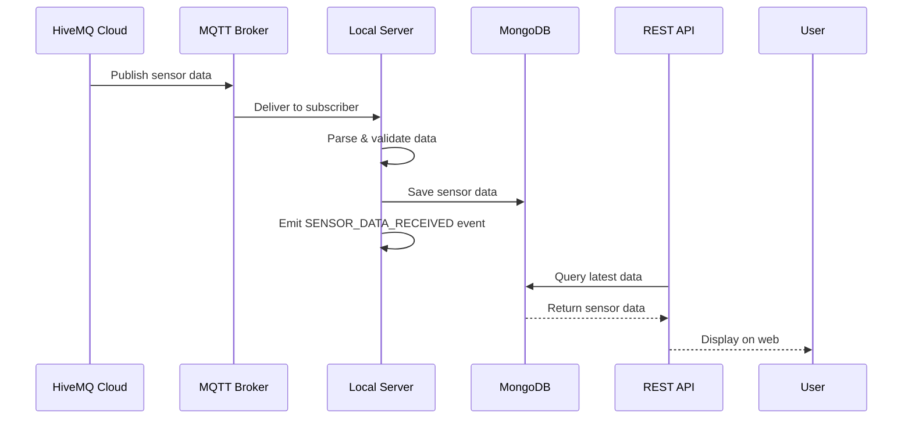

# 📡 Hướng dẫn Publish Sensor Data từ HiveMQ Cloud & Xem trên Web Local

## 🎯 Mục tiêu
Hướng dẫn cách publish sensor data từ HiveMQ Cloud Web Client và xem nó được subscribe & hiển thị trên web server local.

---

## 📋 Điều kiện cần có

### 1. HiveMQ Cloud Account
- Đã tạo cluster trên https://console.hivemq.cloud/
- Có URL cluster: `6f8be00c1970409d9b2b6200758507f0.s1.eu.hivemq.cloud`
- Có username/password hợp lệ

### 2. Local Server
- Server Node.js đang chạy trên port 3000
- MQTT credentials đã được cấu hình đúng trong `.env`
- MongoDB đã kết nối (nếu `ENABLE_DATABASE=true`)

---

## 🚀 Bước 1: Publish từ HiveMQ Cloud

### 1.1 Truy cập HiveMQ Cloud Console
```
URL: https://console.hivemq.cloud/
```
- Đăng nhập tài khoản của bạn
- Chọn cluster có URL: `6f8be00c1970409d9b2b6200758507f0.s1.eu.hivemq.cloud`

### 1.2 Mở WebSocket Client
- Trong cluster dashboard, click tab **"WebSocket Client"**
- Hoặc truy cập trực tiếp: `https://console.hivemq.cloud/websocket-client`

### 1.3 Kết nối tới Broker
- **Host**: `6f8be00c1970409d9b2b6200758507f0.s1.eu.hivemq.cloud`
- **Port**: `8884` (WebSocket SSL)
- **Username**: `[username từ .env hoặc HiveMQ console]`
- **Password**: `[password từ .env hoặc HiveMQ console]`
- **Client ID**: `hivemq-web-client` (hoặc bất kỳ)
- Click **"Connect"**

### 1.4 Publish Sensor Data

#### Tab "Publish"
- **Topic**: `sensors/zone-1/temp-sensor-01/data`
- **QoS**: 0 hoặc 1
- **Payload** (JSON):

```json
{
  "sensorId": "temp-sensor-01",
  "sensorType": "temperature",
  "value": 28.5,
  "farmZone": "zone-1",
  "timestamp": "2025-10-31T10:30:00Z"
}
```

#### Các mẫu sensor data khác:

**🌡️ Temperature Sensor:**
```json
{
  "sensorId": "temp-sensor-01",
  "sensorType": "temperature",
  "value": 32.7,
  "farmZone": "zone-1",
  "timestamp": "2025-10-31T10:30:00Z"
}
```

**💧 Soil Moisture Sensor:**
```json
{
  "sensorId": "moisture-sensor-01",
  "sensorType": "soil_moisture",
  "value": 45.2,
  "farmZone": "zone-1",
  "timestamp": "2025-10-31T10:30:00Z"
}
```

**💡 Light Sensor:**
```json
{
  "sensorId": "light-sensor-01",
  "sensorType": "light",
  "value": 850.0,
  "farmZone": "zone-1",
  "timestamp": "2025-10-31T10:30:00Z"
}
```

**🌬️ Humidity Sensor:**
```json
{
  "sensorId": "humidity-sensor-01",
  "sensorType": "humidity",
  "value": 65.8,
  "farmZone": "zone-1",
  "timestamp": "2025-10-31T10:30:00Z"
}
```

- Sau khi điền xong, click **"Publish"**

---

## 🔍 Bước 2: Kiểm tra Subscription trên Server Local

### 2.1 Kiểm tra Logs Server
Khi publish thành công, server local sẽ log:
```
✅ MQTT Connected to broker
📡 Received sensor data: sensors/zone-1/temp-sensor-01/data
✅ Sensor data saved: temp-sensor-01 - 28.5°C
```

### 2.2 API Endpoint để xem Data
**GET** `http://localhost:3000/api/demo/sensor-data`

#### Response mẫu:
```json
{
  "success": true,
  "data": {
    "sensorData": [
      {
        "_id": "6742a1b2c3d4e5f6789abcd",
        "sensorId": "temp-sensor-01",
        "sensorType": "temperature",
        "value": 28.5,
        "farmZone": "zone-1",
        "timestamp": "2025-10-31T10:30:00.000Z",
        "unit": "°C"
      }
    ],
    "total": 1,
    "mqttConnected": true,
    "lastUpdated": "2025-10-31T10:30:00.000Z"
  },
  "message": "Sensor data retrieved successfully"
}
```

#### Query Parameters:
- `sensorId`: Lọc theo sensor cụ thể (vd: `?sensorId=temp-sensor-01`)
- `limit`: Số lượng records trả về (default: 10)

### 2.3 Xem theo Sensor cụ thể
**GET** `http://localhost:3000/api/demo/sensor-data?sensorId=temp-sensor-01`

---

## 🔄 Luồng Hoạt động (Sequence Diagram)



---

## 🐛 Troubleshooting

### Lỗi "Connection refused: Not authorized"
- ✅ Kiểm tra username/password trong `.env` khớp với HiveMQ console
- ✅ Đảm bảo cluster đang active (không suspended)
- ✅ Kiểm tra quota/limits của HiveMQ

### Không thấy data trong API response
- ✅ Kiểm tra server logs có nhận được message không
- ✅ Kiểm tra MongoDB connection (`ENABLE_DATABASE=true`)
- ✅ Đảm bảo topic pattern đúng: `sensors/{zone}/{sensorId}/data`

### MQTT không connect
- ✅ Kiểm tra `ENABLE_MQTT=true` trong `.env`
- ✅ Restart server sau khi thay đổi credentials
- ✅ Kiểm tra network connectivity tới HiveMQ

---

## 📊 Test Cases

### Test 1: Temperature Sensor
1. Publish temperature data từ HiveMQ
2. Check API: `GET /api/demo/sensor-data?sensorId=temp-sensor-01`
3. Verify: Data xuất hiện với đúng value

### Test 2: Multiple Sensors
1. Publish data từ 3 sensors khác nhau
2. Check API: `GET /api/demo/sensor-data?limit=5`
3. Verify: Tất cả 3 records xuất hiện

### Test 3: Automation Trigger
1. Tạo threshold cho temperature > 30°C
2. Publish temperature = 35°C
3. Check alerts: `GET /api/alerts/active`
4. Verify: Alert được tạo tự động

---

## 🎯 Expected Results

Sau khi publish thành công từ HiveMQ:

1. **Server Logs**: Hiện message nhận được
2. **Database**: Sensor data được lưu
3. **API Response**: Data xuất hiện trong `/api/demo/sensor-data`
4. **Automation**: Nếu vượt threshold → Alert được tạo
5. **WebSocket**: Real-time updates (nếu có dashboard)

---

## 📝 Notes

- **Topic Pattern**: `sensors/{farmZone}/{sensorId}/data`
- **QoS**: Sử dụng QoS 1 để đảm bảo delivery
- **Timestamp**: Nên dùng ISO 8601 format
- **Farm Zone**: Hỗ trợ multiple zones (zone-1, zone-2, etc.)
- **Sensor Types**: temperature, soil_moisture, light, humidity, ph, etc.

---

**File**: `docs/HIVEMQ_PUBLISH_GUIDE.md`  
**Last Updated**: October 31, 2025</content>
<parameter name="filePath">e:\SWD392\docs\HIVEMQ_PUBLISH_GUIDE.md