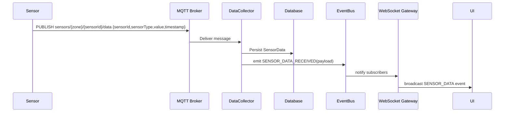
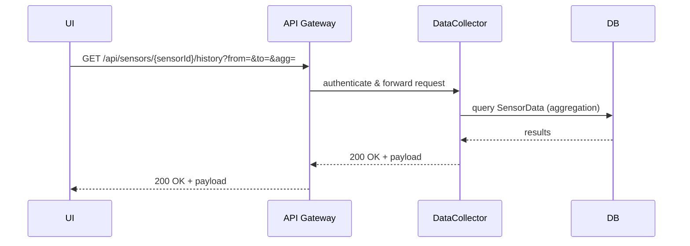

# UC02 — Xem dữ liệu cảm biến (View Sensor Data)

## Mục tiêu
Hiển thị dữ liệu cảm biến theo thời gian thực và truy vấn lịch sử.

## Actors
- Farm Owner / Technician (User)
- Dashboard UI (Web/Mobile)

## System Components (Lifelines)
- UI (Browser / Mobile App)
- API Gateway (REST)
- WebSocket Gateway
- DataCollector Service
- Database (MongoDB / Time-series)
- MQTT Broker
- Sensor Device
- Event Bus

## Preconditions
- Sensor devices đã kết nối tới MQTT broker.
- User đã đăng nhập và có quyền xem dữ liệu.
- WebSocket hoặc REST endpoint sẵn sàng.

## Postconditions
- Dashboard hiển thị dữ liệu real-time.
- Recent sensor data được lưu vào DB.

---

## Main Flow (Real-time via MQTT → WS)

Participants (sequence): Sensor → MQTT Broker → DataCollector → Event Bus → WebSocket Gateway → UI

1. Sensor publishes message to topic `sensors/{farmZone}/{sensorId}/data` with payload: { sensorId, sensorType, value, timestamp }
2. MQTT Broker receives message and forwards to subscribers. (internal)
3. DataCollector Service (subscribed to relevant topics) receives the message.
4. DataCollector validates payload, transforms into `SensorData` entity.
5. DataCollector persists `SensorData` to Database (async write).
6. DataCollector emits event `SENSOR_DATA_RECEIVED` on Event Bus with payload (sensorDataId, sensorType, farmZone, value, timestamp).
7. WebSocket Gateway (subscribed to Event Bus) receives `SENSOR_DATA_RECEIVED` and broadcasts to connected UI clients subscribed to that farmZone/topic via socket.io room `zone-{farmZone}`.
8. UI receives socket update and updates real-time charts.

Notes for sequence diagram: messages 1→3 show MQTT publish/subscribe; 3→5 include validation and DB write; 6→7 show internal Event Bus → WS broadcast.

---

## Main Flow (Historical data via REST)

Participants (sequence): UI → API Gateway → DataCollector → Database → API Gateway → UI

1. UI requests historical data: `GET /api/sensors/{sensorId}/history?from=...&to=...&agg=...`.
2. API Gateway authenticates user and authorizes access.
3. API Gateway forwards request to DataCollector Service.
4. DataCollector queries Database for matching `SensorData` documents.
5. Database returns results (paginated or aggregated).
6. DataCollector returns data to API Gateway which returns HTTP 200 with payload.
7. UI renders charts using returned data.

## Alternate Flows
- A1: If DB query is slow, API returns cached/partial results and kicks off background aggregation.
- A2: If MQTT temporarily disconnected, DataCollector queues messages (local buffer) and attempts reconnection.

## Data contracts (payload shapes)
- Sensor publish:
```json
{ "sensorId": "temp-sensor-01", "sensorType": "temperature", "value": 36.7, "timestamp": "2025-10-30T08:23:10Z", "farmZone": "zone-1" }
```
- WebSocket broadcast:
```json
{ "event": "SENSOR_DATA", "data": { "sensorId":"...", "value":36.7, "timestamp":"..." } }
```
- REST response: array of SensorData objects with pagination metadata.

## Time / Performance considerations
- Real-time path: end-to-end target ≤ 200ms from broker receive → UI update (excluding network latency to sensor).
- Historical queries: support large time windows via server-side aggregation (MongoDB aggregation pipeline).

## Diagram notes (for drawing)
- Sequence diagram lifelines: Sensor, MQTT Broker, DataCollector, DB, Event Bus, WebSocket Gateway, UI.
- Communication diagram: show channels MQTT (Sensor↔Broker↔DataCollector), REST (UI↔API Gateway↔DataCollector↔DB), WS (DataCollector/EventBus→WebSocket→UI). Use topic names and REST endpoints as message labels.

---

## Edge cases
- Late-arriving timestamps (sensor clock skew) — handle by server-side timestamp normalization and duplication detection.
- High-frequency sensors — use downsampling/aggregation for UI.

## Test cases (quick)
1. Publish a sample sensor message; assert UI receives via WebSocket and DB contains record.
2. Query historical endpoint and validate returned aggregations.

---

File: `docs/use-cases/UC02_View_Sensor_Data.md`

## Mermaid sequence diagrams

### Real-time flow (MQTT → WS)



### Historical data flow (REST)



> Note: paste these blocks into any Mermaid-compatible renderer (Markdown preview, VS Code Mermaid plugin, or PlantUML server that supports Mermaid) to visualize sequence diagrams.
